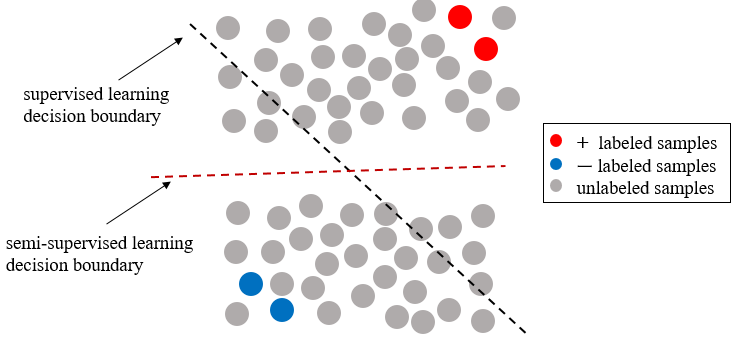
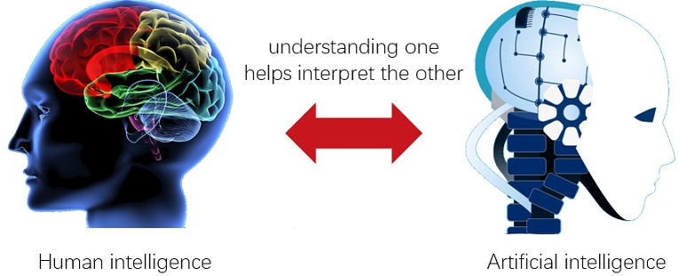

## Research Interests

* Semi-Supervised Learning: manually labeled samples usually are expensive and scarce.  It is economical to train classifiers (shallow or deep models) using a small amount of labeled samples and aboundant unlabeled samples.

* Generic Neural Learning: understanding brain learning mechanism and developing highly effective AI algorithms are a pair of dual problems. It is interesting to explore the underlying learning rules shared between biological and artificial neural networks.

 
 
## Projects & Funds
#### Principal Investigator/Co-Investigator
 * Semi-Supervised Deep Learning Algorithms and Their Applications on Time Series Data Prediction. Natural Science Foundation Of China (NSFC) Young Scientists Fund (**PI**)
 * Research on Deep Spiking Neural Network Model and Applications for Spatio-Temporal Data Analysis. Natural Science Foundation of Shanghai (**PI**)
 * Startup Fund for Youngman Research at Shanghai Jiao Tong University (SFYR at SJTU) (**PI**)
 * Research on Key Technologies of Brain-like Computing Models for Video Analysis. Natural Science Foundation Of China (NSFC), 2019.01-2023.01 (**CoI**)
* Multilayer Non-Positive Definite Kernel Learning Theory, Algorithm and Application Research. Natural Science Foundation Of China (NSFC), 2020.01-2024.01 (**CoI**)
* Construction of Heart Fiber DTI Map and Cardiac Fiber Constant Feature Detection Based on Fiber Information Joint Clustering and Sparse Registration. Natural Science Foundation Of China (NSFC), 2019.01-2021.01 (**CoI**)
#### Participant
* Marine Navigational Decision Aid Based Upon Vessel Route Prediction from Historical Evidence.  National Research Foundation (NRF) of Singapore, 2015.08 - 2017.12
* NeuCube System for Spatio-Temporal Data Analysis, Visualization and Knowledge Extraction. AUT Strategic Research Investment Fund, 2014.12 - 2015.08
* Ecological Pollution Monitoring and Warning Oriented Remote Sensing Image Analysis and Understanding. Ministry of Science and Technology of China International Cooperation Project, 2014.02 - 2014. 11 
* Remote Sensing Monitoring, Understanding and Ecological Pollution Warning Intelligent Research. Ministry of Science and Technology of China International Cooperation Project, 2010.09 - 2013.11

## Patents:
*  Graph-based k-means for nonlinear manifold clustering and representative points selection, CN103617609B
*  Multi-resolution variant regional level set for image segmentation,  CN102044077B
*  Historical AIS data modeling for path prediction, UK Patent

## Selected Publications 
(Full Publications: [Google Scholar](https://scholar.google.com.sg/citations?user=TDg-0cQAAAAJ&hl=en))
* Xiao Han, Zihao Wang, Enmei Tu*, Gunnam Suryanarayana, and Jie Yang. Semi-Supervised Deep Learning Using Improved Unsupervised Discriminant Projection, _International Conference on Neural Information Processing (ICONIP)_, 2019.
* Doborjeh Maryam, Nikola Kasabov, Zohreh Doborjeh, Reza Enayatollahi, Enmei Tu, and Amir H. Gandomi. Personalised modelling with spiking neural networks integrating temporal and static information. _Neural Networks_, 119 (2019): 162-177.
* Chen Mingjian, Hao Zheng, Changsheng Lu, Enmei Tu, Jie Yang, and Nikola Kasabov. Accurate breast lesion segmentation by exploiting spatio-temporal information with deep recurrent and convolutional network. _Journal of Ambient Intelligence and Humanized Computing_ (2019): 1-9.
* Suryanarayana Gunnam, Enmei Tu, and Jie Yang. Infrared super-resolution imaging using multi-scale saliency and deep wavelet residuals. _Infrared Physics & Technology_, 97 (2019): 177-186.
* Chen Xingyu, Fanghui Liu, Enmei Tu, Longbing Cao, and Jie Yang. Deep-PUMR: Deep Positive and Unlabeled Learning with Manifold Regularization. _International Conference on Neural Information Processing (ICONIP)_, 2018.
* Chen Mingjian, Hao Zheng, Changsheng Lu, Enmei Tu, Jie Yang, and Nikola Kasabov. A Spatio-Temporal Fully Convolutional Network for Breast Lesion Segmentation in DCE-MRI. _International Conference on Neural Information Processing (ICONIP)_, 2018.
* Wang Lu, Chao Ma, Enmei Tu, Jie Yang, and Nikola Kasabov. Discrete Sparse Hashing for Cross-Modal Similarity Search. _In International Conference on Neural Information Processing (ICONIP)_, 2018.
* Enmei Tu, Guanghao Zhang, Lily Rachmawati et al. Exploiting AIS Data For Intelligent Maritime Navigation: A Comprehensive Survey, _IEEE Transactions on Intelligent Transportation System_, 2018, 19(5): 1559-1582.
* Mao Shangbo, Enmei Tu, Guanghao Zhang, Lily Rachmawati, Eshan Rajabally, and Guang-Bin Huang. An automatic identification system (AIS) database for maritime trajectory prediction and data mining. _In Proceedings of ELM-2016, pp. 241-257_. Springer, Cham, 2018.
* Zhang Guanghao, Enmei Tu, and Dongshun Cui. Stable and improved generative adversarial nets (GANS): A constructive survey.  _IEEE International Conference on Image Processing (ICIP)_, pp. 1871-1875. 2017.
* Enmei Tu, Guanghao Zhang, Lily Rachmawati, Eshan Rajabally, Shangbo Mao, and Guang-Bin Huang. A theoretical study of the relationship between an ELM network and its subnetworks. _International Joint Conference on Neural Networks (IJCNN)_, pp. 1794-1801. IEEE, 2017.
* Enmei Tu, Yaqian Zhang, Lin Zhu, Jie Yang, Nicola Kasabov. A Graph-Based Semi-Supervised $k$ Nearest-Neighbor Method for Nonlinear Manifold Distributed Data Classification, _Information Scieces_: 2016, 367, 673- 688
* Nikola Kasabov, Nathan Matthew Scott, Enmei Tu, Stefan Marks, Neelava Sengupta, Elisa Capecci, Muhaini Othman et al. Evolving spatio-temporal data machines based on the NeuCube neuromorphic framework: design methodology and selected applications. _Neural Networks_ 78 (2016): 1-14.
* Enmei Tu. Graph Based Machine Learning Algorithms Design and Its Application in Neural Network Research, PhD Thesis (In Chinese), Shanghai Jiao Tong University:2014
* Enmei Tu, Nikola Kasabov, Jie Yang. Mapping Temporal Variables Into the NeuCube for Improved Pattern Recognition, Predictive Modeling, and Understanding of Stream Data, _IEEE Transactions on Neural Networks and  Learning Systems_:2016
* Enmei Tu, Jie Yang, Nicola Kasabov, Yaqian Zhang. Posterior Distribution Learning (PDL): A Novel Supervised Learning Framework Using Unlabeled Samples to Improve Classification Performance, _Neurocomputing_: 2015, 157, 173--186
* Enmei Tu, Longbing Cao, Jie Yang, Nicola Kasabov. A novel Graph-based K-means for Nonlinear Manifold Clustering and Representative Selection, _Neurocomputing_: 2014, 143, 109--122
* Enmei Tu, Jie Yang, Zhenghong Jia, Nicola Kasabov. Posterior Distribution Learning (PDL): A Novel Supervised Learning Framework, _Neural Information Processing_: 2014, 86--94
* Enmei Tu, Nikola Kasabov, Marini Othman, Yuxiao Li, Susan Worner, Jie Yang, Zhenghong Jia. Neucube (st) for Spatio-Temporal Data Predictive Modelling with a Case Study on Ecological Data,  _International Joint Conference on Neural Networks (IJCNN)_:2014, 638--645
* Enmei Tu, Jie Yang, Jiangxiong Fang, Zhenghong Jia, Nikola Kasabov. An Experimental Comparison of Semi-supervised Learning Algorithms for Multispectral Image Classification, _Photogrammetric Engineering & Remote Sensing_: 2013, 79(4), 347--357
