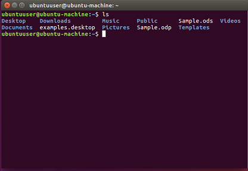

## Information for prospective students
* I have 1-2 full-time Master students vacancies each year. Currently, I have no plan to recruit PhD students. If you are interested in pursuing a Master's degree under my supervision, please feel free to contact me.
* For SJTU students who want to participate in lab researches on machine learning and artificial intelligence, please contact me directly with an email titled "SJTU Student Research".
* I am happy to write recommendation letters for the students who attend my classes or take part in research activities in our lab. Please send me a copy of your transcript and CV (if you have one). 

## Major AI related conferences

Conference Name  | Submission Deadline | Conference Date |Conference Location 
----------------- | -------------| -------------|-------------
[AAAI-21](https://aaai.org/Conferences/AAAI-21/)| Sep 09, 2020| Feb 02-09, 2021| virtual
[ICLR-21](https://iclr.cc/) | Oct 02, 2021| May 4-7, 2021|Vienna, Austria
[CVPR-21](http://cvpr2021.thecvf.com/) | Nov 16, 2020|Jun 21-24, 2021|Nashville, USA
[ACL-21](https://2021.aclweb.org/)|TBD|Aug 2 – 4, 2021|Bangkok, Thailand
[ICCV-21](http://iccv2021.thecvf.com/home)|Mar 17, 2021|Oct 11-17, 2021|Montreal, Canada
[NeurIPS-20](https://nips.cc/Conferences/2020)| ~~May 05, 2020~~| Dec 2-8, 2020|Vancouver, Canada
[ECCV-20](https://eccv2020.eu/)|~~Mar 05, 2020~~|Aug 23-28, 2020|Glasgow, UK
[SIGKDD-20](https://www.kdd.org/kdd2020/#!) | ~~Feb 13, 2020~~ | Aug 22, 2020 | San Diego, CA, USA
[ICML-20](https://icml.cc/Conferences/2020)| ~~Jan 30, 2020~~| Jul 12-18, 2020|Vienna, Austria
[IJCAI-20](http://www.ijcai20.org) | ~~Jan 21, 2020~~|Jul 11-17, 2020|Yokohama, Japan

## Best universities in China ([full ARWU ranking list](http://www.shanghairanking.com/World-University-Rankings-2020/China.html))

Rank | University Name | Location | Province
----- | ------------ | --------- | ----------
1	|Tsinghua University |	Beijing | Beijing
2	|Peking University	|Beijing | Beijing
3	|Zhejiang University	|Hangzhou | Zhejiang
4	|Shanghai Jiao Tong University|	Shanghai | Shanghai
5	|University of Science and Technology of China|	Hefei |Anhui
6	|Fudan University	|Shanghai | Shanghai
7	|Huazhong University of Science and Technology|	Wuhan | Hubei
7	|Nanjing University	|Nanjing | Jiangsu
9	|Sun Yat-Sen University	|Guangzhou | Guangdong
10	|Harbin Institute of Technology	|Harbin | Heilongjiang

#### Here is a [Map of China](https://www.chinadiscovery.com/china-maps/china-provincial-map.html) and a good [overview of China](https://www.chinadiscovery.com/travel-guide/facts.html)

## Useful commands and skills for a new Linuxer
Switching from Windows to Linux, especially the command line interaction terminal on a server, is probably a painful experience for most people! But as long as you get familiar with some basic commands and skills, you’ll find that Linux is actually easy to deal with and very efficient for productivity in terms of system management and computational extensive model development. Here I summarized some useful commands and skills from the perspective of remote scientific computing. Hopefully, they could help you quickly adapt to the new interaction method. **Please click [HERE](linux.md) to browse.**

###### Updated on August, 2020

